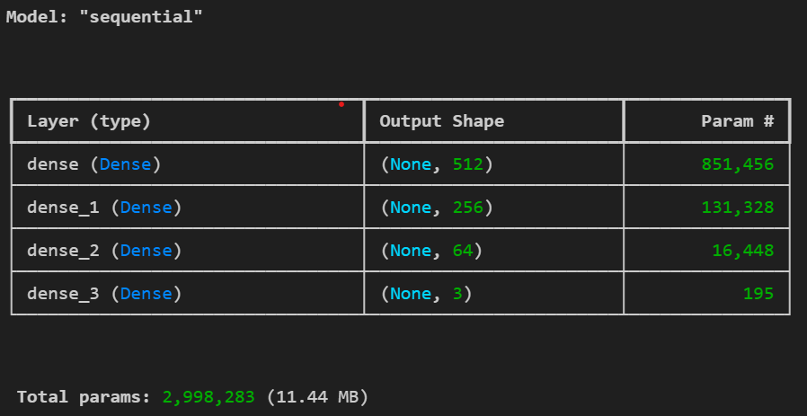

# Emotion Recognition Cloud Service (Mediapipe Holistic + MLP + FastAPI + React)

## Project Overview

1. Using MP Holistic collected dataset with 3 emotions: happy, sad, angry (90 images in total)

2. Trained MLP (Multi-Layer Perceptron) - 97% accuracy

3. Runs as two microservices (frontend + backend) and fully containerized using Docker Compose

## Folder Structure

backend/
    Logs/...
    mp_data/
        angry/...
        happy/...
        sad/...
    app.py
    Dockerfile
    model_mlp.h5
    model.h5
    model.ipynb
    requirements.txt
frontend/
    build/...
    node_modules/...
    public/
        images/
        index.html
    src/
        App.css
        App.js
        index.css
    Dockerfile
    package-lock.json
    package.json
docker-compose.yml
package-lock.json
README.md

## Prerequisities

- Node.js 18
- Python 3.10 (Mediapipe doesn't support > 3.11)
- pip
- Conda (optional, for reproducible environment)
- mediapipe
- opencv-python
- fastapi
- tensorflow
- Docker Desktop

## How to Run (w/o Docker)

1. Backend setup
`cd backend`

2. Install required packages

`pip install -r requirements.txt`

3. Run server for backend

`uvicorn app:app --reload --host 0.0.0.0 --port 8000`

4. Backend runs at:

http://localhost:8000 

5. Frontend setup

`cd frontend`

6. Install packages from "package.json"

`npm install`

7. Start server for frontend

`npm start`

8. Frontend runs at:

http://localhost:3000

## How to Run (**with** Docker)

1. Create, start and run containers (reading docker-compose.yml)

`docker-compose up --build`

``

2. Containers start at

Frontend: http://localhost:3000 

Backend: http://localhost:8000 

This simulates a cloud microservice system
